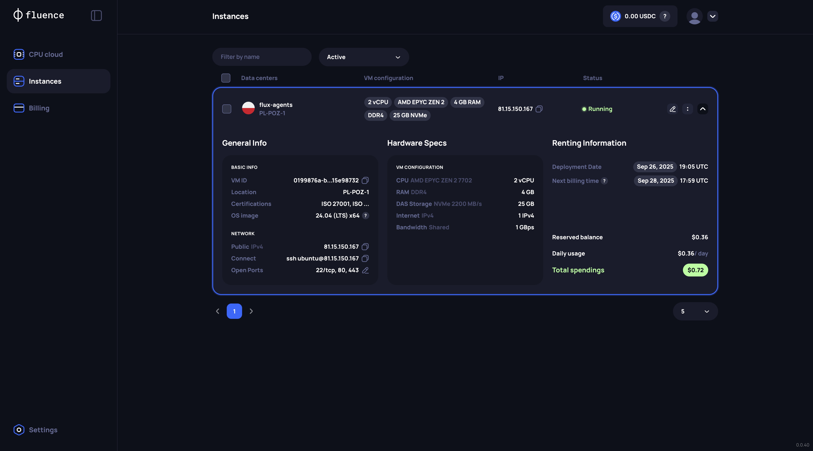

# Flux: Autonomous Support for the On-Chain World

Flux is a Web3-native, AI-powered customer support platform designed for the decentralized economy. We empower crypto organizations to deploy intelligent AI agents that resolve user queries with on-chain awareness and verifiable integrity.

# 🚩 **The Problem: Web2 Tools in a Web3 World**

Customer support in the crypto ecosystem is fundamentally broken. We are applying centralized, off-chain support models to decentralized, on-chain problems, leading to a crisis of trust, efficiency, and security.

**Lack of On-Chain Context**: Traditional support agents cannot read a block explorer, interpret on-chain actions, or diagnose transaction failures. They are blind to the source of truth.

**High Operational Costs & Slow Resolutions**: Scaling a 24/7 team of crypto-savvy human agents is prohibitively expensive and slow, leaving users frustrated.

**Centralized Security Risks**: Funneling user issues through Web2 helpdesks creates a massive surface area for phishing, social engineering, and data breaches. In an industry built on self-custody, this is an unacceptable risk.

**The core issue is a mismatch of paradigms**: Web3 operates on verifiable proof, while traditional support operates on "trust me."

# 🧠 **Knowledge Primer: The Flux Solution**

Flux bridges this gap by creating autonomous, on-chain-aware AI agents. Instead of creating support tickets, our agents create verifiable resolutions.

Our platform enables any organization (DeFi protocols, DAOs, NFT projects) to:

**Onboard Knowledge**: Train AI agents on their specific documentation, whitepapers, and URLs.

**Connect On-Chain Data**: Grant agents read-only access to block explorers, and other protocol-specific APIs.

**Authorize Safe Actions**: Empower agents to execute pre-approved, trust-minimized actions (e.g., refunds) through an enterprise-based AI agent with strict spending limits.

The result is a support experience that is instant, intelligent, and crypto-native. Users get accurate answers backed by on-chain data, and organizations reduce costs while enhancing security and user trust.

# 🛠️ **Key Features (MVP)**

## For Organizations (Admin Dashboard)

**Agent Deployment**: Spin up specialized agents instantly.

**Knowledge Base Management**: Upload and index PDFs, documentation, and specific URLs for Agent RAG (Retrieval-Augmented Generation).

**Auditable Logs**: Immutable records of all customer chats and all agent-executed on-chain verification checks/transactions.

## For Customers (Widget/Chat)

**Instant Resolution**: Get answers and secure, instant on-chain actions directly from the agent.

# 🚀 **Getting Started**

Follow these steps to run the Flux application locally:

## Prerequisites

- Python 3.12 (for the Python backend)
- Node.js 18+ and pnpm (for the TypeScript backend and frontend)
- Git

## 1. Python Backend (Agents Service)

The Python backend handles AI agent management and runs on port 8000.

```bash
cd agents

python -m venv venv
source venv/bin/activate  # On Windows: venv\Scripts\activate

pip install -r requirements.txt

python main.py
```

The Python backend will be available at `http://localhost:8000`

## 2. TypeScript Backend (API Service)

The TypeScript backend provides the main API and runs on port 7990.

```bash
cd backend

pnpm install

pnpm run types

pnpm run dev
```

The TypeScript backend will be available at `http://localhost:7990`

## 3. Frontend (Next.js)

The frontend is built with Next.js and runs on port 3000.

```bash
cd frontend

pnpm install

pnpm run dev
```

The frontend will be available at `http://localhost:3000`

## Environment Variables

Create `.env` files in the respective directories with the required environment variables:

- **agents/.env**: Configure Python backend settings (API keys, database URLs)
- **backend/.env**: Configure TypeScript backend settings (Supabase credentials, JWT secrets)
- **frontend/.env.local**: Configure frontend settings (API endpoints)

## Production Build

For production deployment:

```bash
cd agents && python main.py

cd backend && pnpm run build && pnpm start

cd frontend && pnpm run build && pnpm start
```

# 🚀 **Hackathon Integrations**

We built Flux using cutting-edge decentralized infrastructure to maximize trust, scalability, and performance.

## 1. Artificial Superintelligence Alliance (ASI)

**Agent Architecture**: We utilize the uAgent framework to create resilient, conversational support agents.

**Structured Reasoning**: MeTTa is used for the agent's core logic, enabling secure, structured reasoning necessary for complex tasks like on-chain claim verification before a contract call is executed.

**Omni-Channel**: The use of uAgents allows support via both REST endpoints and native ASI Chat Protocol integration.

## 2. ENS

**Agent Identity**: Every deployed Flux agent is registered with a unique ENS subdomain (e.g., support.uniswap.eth, claims.dao.eth).

**Auditability**: Users and organizations can verify the authenticity and source of any agent-initiated transaction by checking the ENS name, making the platform fully trust-transparent.

## 3. Fluence

**DePIN Compute**: Our organisation based support AI agents (quantized for efficiency) run on Fluence Virtual Servers.

**Benefit**: This provides a decentralized, resilient, CPU-only compute solution, offering a low-cost, cloudless alternative to traditional centralized infrastructure.

IP => https://81.15.150.167/

You will see all the endpoints in this IP's response. You might have to continue by clicking on Advanced since it's not domain and SSL gated.



# 📜 **License**

`flux` is available under the MIT license. See the [`LICENSE`](./LICENSE) file for more info.

# 🤝 **Contributing**

Please read [`CONTRIBUTING.md`](./CONTRIBUTING.md) for details on our code of conduct, and the process for submitting pull requests to us.

# 💥 **Contributors**

<a href="https://github.com/karanpargal/flux/graphs/contributors">

</a>

# 🚨 **Forking this repo**

Many people have contacted us asking if they can use this code for their own websites. The answer to that question is usually "yes", with attribution. There are some cases, such as using this code for a business or something that is greater than a personal project, that we may be less comfortable saying yes to. If in doubt, please don't hesitate to ask us.

We value keeping this site open source, but as you all know, _**plagiarism is bad**_. We spent a non-negligible amount of effort developing, designing, and trying to perfect this iteration of our website, and we are proud of it! All we ask is to not claim this effort as your own.

Refer to this handy [Quora post](https://www.quora.com/Is-it-bad-to-copy-other-peoples-code) if you're not sure what to do. Thanks!
